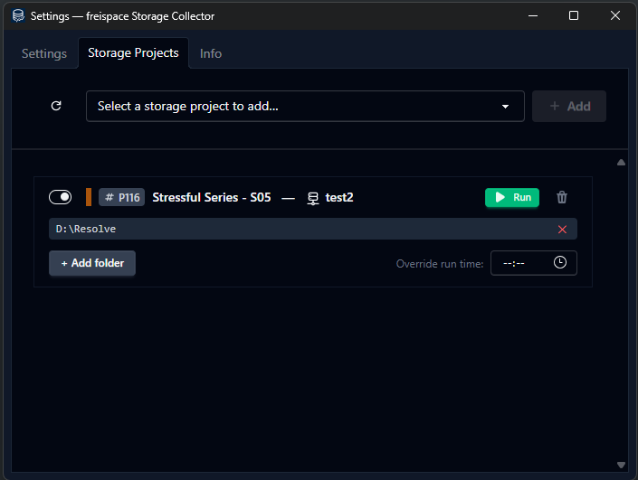
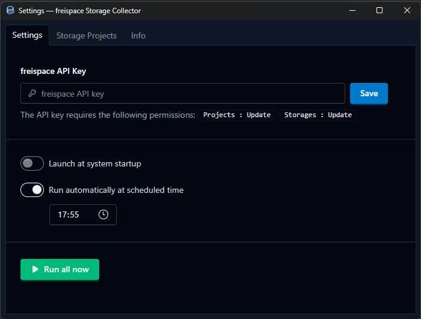

# freispace Storage Collector

A cross-platform desktop tray app that monitors local folder sizes and submits storage statistics to [freispace](https://freispace.com) on a daily schedule.




## What it does

- Runs silently in the system tray
- Walks configured local folders recursively and sums file sizes
- POSTs storage statistics to `https://api.freispace.com/v1/storages/{id}/projects/{id}/statistics/{date}`
- Retries failed submissions automatically (up to 10 attempts, every 5 minutes)
- Shows run status via five tray icon states: Idle, Active, OK, Warning, Error
- Streams a live event log to the UI with info/warning/error filtering

## How to use

1. Create an API key in freispace. Required permissions: `Projects:Update` & `Storage:Update`
2. Paste it in the the freispace Storage Collector



3. Update the list of Project Storages, select and, and select the folders to monitor

## Tech stack

| Layer | Technologies |
|---|---|
| Frontend | Svelte 5 (runes), TypeScript, Tailwind CSS 4, Vite 6 |
| Backend | Rust, Tauri 2, SQLite (sqlx), tokio, reqwest |
| Scheduler | tokio-cron-scheduler |
| Distribution | GitHub Actions → native installers (Windows, macOS, Linux) |

## Prerequisites

- [Rust](https://rustup.rs/) (MSRV 1.77.2)
- [Node.js](https://nodejs.org/) ≥ 20
- [pnpm](https://pnpm.io/)
- Platform build deps per [Tauri prerequisites](https://v2.tauri.app/start/prerequisites/)

## Development

```bash
pnpm install
pnpm dev          # full Tauri dev mode (frontend + backend)
pnpm dev:frontend # frontend only (Vite on port 1420)
```

## Build

```bash
pnpm build        # produces native installer in src-tauri/target/release/bundle/
```

## Type checking

```bash
pnpm check        # svelte-check (frontend TypeScript)
cd src-tauri && cargo clippy  # Rust lints
```

## Configuration

All settings are persisted in SQLite in the OS app data directory (`com.freispace.storage-collector`).

| Setting | Description |
|---|---|
| API Key | freispace API key for authentication |
| Schedule time | Daily run time (local timezone, default 17:55) |
| Auto-run | Enable/disable the daily scheduler |
| Folder configs | Mappings of `(storage_id, project_id)` → local folder path |

## Usage

1. Enter your freispace API key in the Settings tab
2. The app fetches your available storages and projects from the API
3. Map each storage project to a local folder path
4. Set a daily schedule time and enable auto-run
5. Use "Trigger All" to run a manual collection at any time

The app window hides to the tray on close. Right-click the tray icon to show the window or quit.

## Database schema

Four SQLite tables in `0001_initial.sql`:

- `settings` — key/value store (api_key, schedule, auto-run flag)
- `folder_configs` — storage/project/folder mappings with optional per-folder schedule override
- `pending_submissions` — failed API calls queued for retry
- `log_entries` — append-only audit log, pruned to 10,000 rows

## CI / Release

GitHub Actions workflows in `.github/workflows/`:

- `ci.yml` — type-check, Rust tests, Clippy on every push
- `release.yml` — builds native installers for Windows, macOS, and Linux via `tauri-apps/tauri-action`
